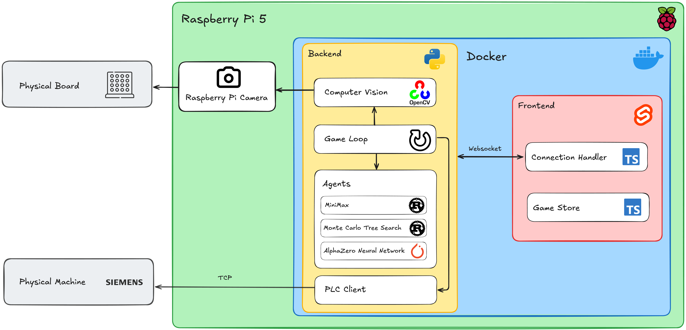
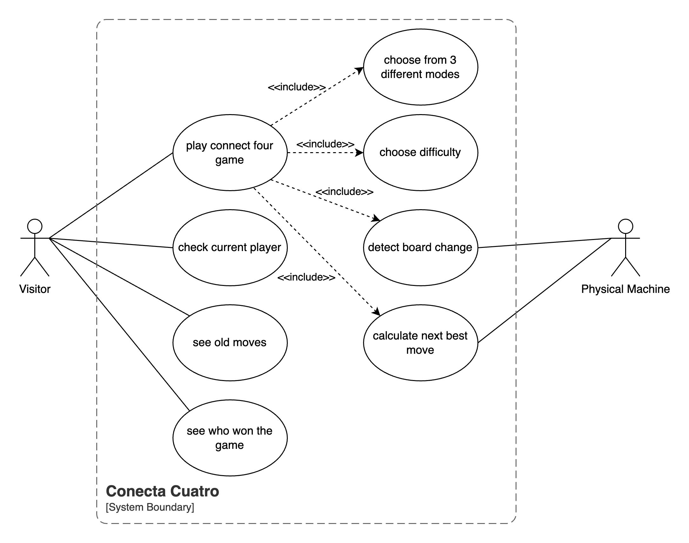
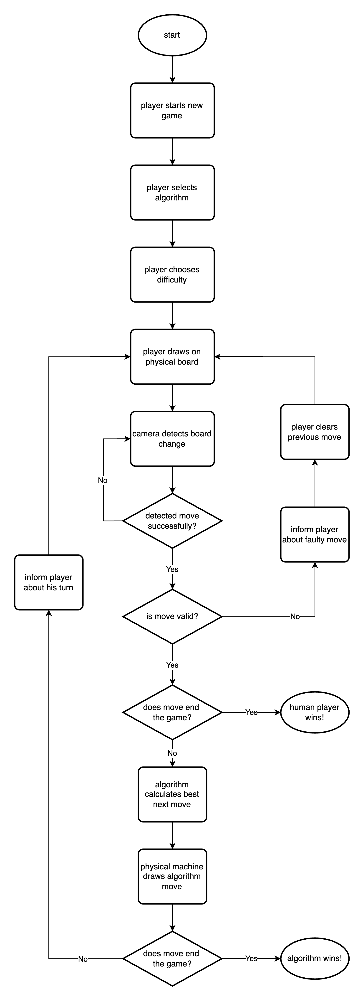
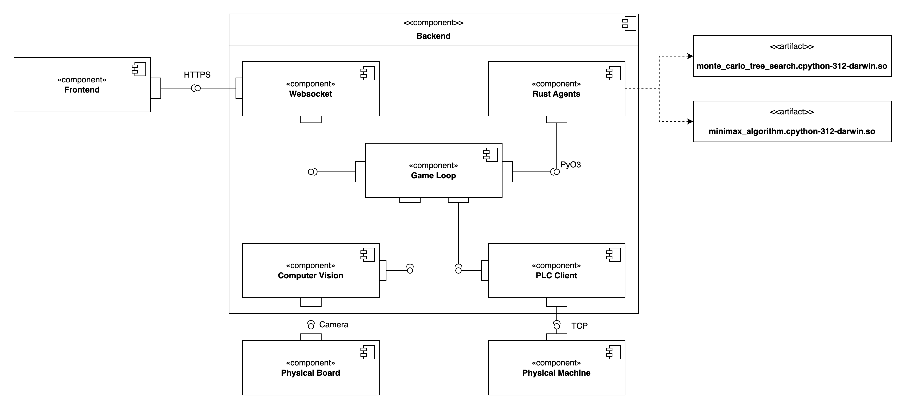

# Conecta-Cuatro

## Missing Steps

1. TCP connection to SPS not fully established.
2. [Machine config](/connect-four-api/hardware/machine_config.json) missing (x and y coordinates are the zero position of the machine). Half size of the field equals the center of any field on the board.
3. Camera recognition with live environment not tested.

## Overview

Conecta-Cuatro is an interactive Connect Four implementation that bridges physical and digital gameplay. The project combines a physical machine featuring robotic arms, a traditional Connect Four board, and computer vision to create an engaging human-machine gaming experience. This project was developed as a final apprenticeship project for demonstration at the diploma ceremony.

## Table of Contents

1. [Overview](#overview)
2. [Background](#background)
3. [Features](#features)
4. [Project Architecture](#project-architecture)
5. [Installation and Setup](#installation-and-setup)
6. [Usage Guide](#usage-guide)
7. [Technical Details](#technical-details)
8. [Contributors](#contributors)

## Background

This project was conceived as a showcase piece for the apprenticeship diploma ceremony, demonstrating the integration of various technologies in an interactive and engaging format. It combines mechanical engineering, computer vision, and artificial intelligence to create a unique gaming experience.

## Features

- Responsive Svelte-based user interface
- Computer vision for real-time move detection
- Multiple AI opponents:
  - MiniMax Algorithm
  - Monte Carlo Tree Search Algorithm
  - AlphaZero Neural Network
- Seamless physical machine integration
- Real-time game state synchronization

## Project Architecture

The system consists of two primary components:

- Physical Hardware:
  - Precision-controlled robotic arms
  - Standard Connect Four gaming board
  - High-resolution camera system
- Software Stack:
  - Real-time computer vision processing
  - Core game logic engine
  - Precision robotics control system

### Architecture Diagram



### Use Case Diagram



### Flowchart Diagram



### Components Diagram



### Repository Structure

```tree
conecta-cuatro/
├── connect-four-api/
│   ├── agents/
│   │   ├── alphazero/                     # Sub Project to create a Neural Network agent
│   │   │   ├── training/
│   │   │   └── alphazero_connect_four.pt  # Neural Network Model
│   │   │
│   │   ├── minimax/
│   │   ├── monte-carlo/
│   │   └── move_calculator.py             # Interface to access different agents
│   │
│   ├── api/
│   ├── core/
│   ├── hardware/
│   │   ├── contour_recognition.py
│   │   ├── machine_config.json            # Config to convert columns to machine coords
│   │   └── plc_client.py                  # Client to communicate w/ physical machine
│   │
│   └── tests/                             # PyTest Unittests
│
├── docs/                                  # Documentation files
│
└── frontend/                              # Svelte frontend application
    ├── src/
    │   ├── lib/                           # Shared utilities
    │   │   ├── components/
    │   │   └── stores/
    │   └── routes/
    └── static/                            # Static assets
```

## Installation and Setup

### System Requirements

- Docker Desktop 24.0.0 or later
- Python 3.11 or later
- Node.js 18.0.0 or later
- npm 9.0.0 or later
- Rust toolchain (required for agent compilation)
- Minimum 4GB RAM
- USB webcam or built-in camera

## Usage Guide

### Docker

Docker is currently only supported on Windows, due to issues when importing the wheels from MacOS or Linux

1. Clone the repository

```bash
git clone https://gitlab.com/GIBZ/teaching/m241-m245/2024/connectfour/conecta-cuatro.git
```

2. Go to the root directory

```bash
cd conecta-cuatro
```

3. Start the docker container

```bash
docker compose -f docker-compose.prod.yml up
```

### Local

1. Clone the repository

```bash
git clone https://gitlab.com/GIBZ/teaching/m241-m245/2024/connectfour/conecta-cuatro.git
```

2. Go to the root directory

```bash
cd conecta-cuatro
```

3. Create a virtual environment and activate it

```bash
python -m venv .venv
```

Windows:

```cmd
.venv/Scripts/activate
```

Linux/MacOS:

```bash
source .venv/bin/activate
```

4. Go to the backend directory and install the requirements

```bash
cd connect-four-api
pip install -r requirements.txt
```

5. Install the local agent bindings

```bash
cd connect-four-api/agents/minimax
maturin develop
```

```bash
cd connect-four-api/agents/monte-carlo
maturin develop
```

5. Start the server

```bash
cd connect-four-api
python main.py
```

6. Start the client

```bash
cd frontend
npm i
npm run dev
```

## Contributors

| Contributor | Contributions               |
| ----------- | --------------------------- |
| Alaxsan     | Mockup & Design             |
| Arjanis (Me)| Computer Vision & Backend   |
| Emre        | Camera Access               |
| Shamoun     | Board Column to Coordinates |
| Timo        | Frontend                    |
| Pascal      | Backend                     |

---

_Note: This project is part of an apprenticeship final project and was specifically designed for demonstration purposes at the diploma ceremony._
